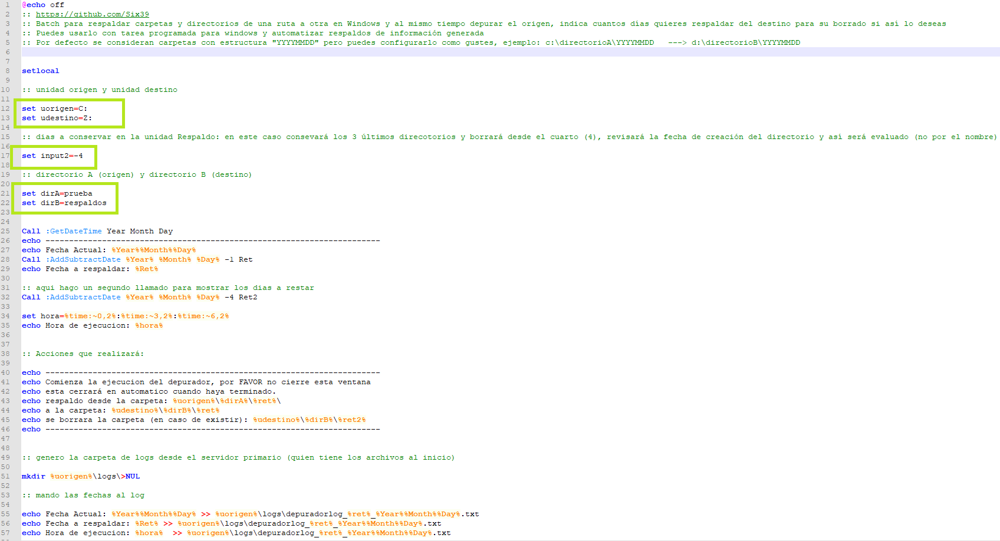
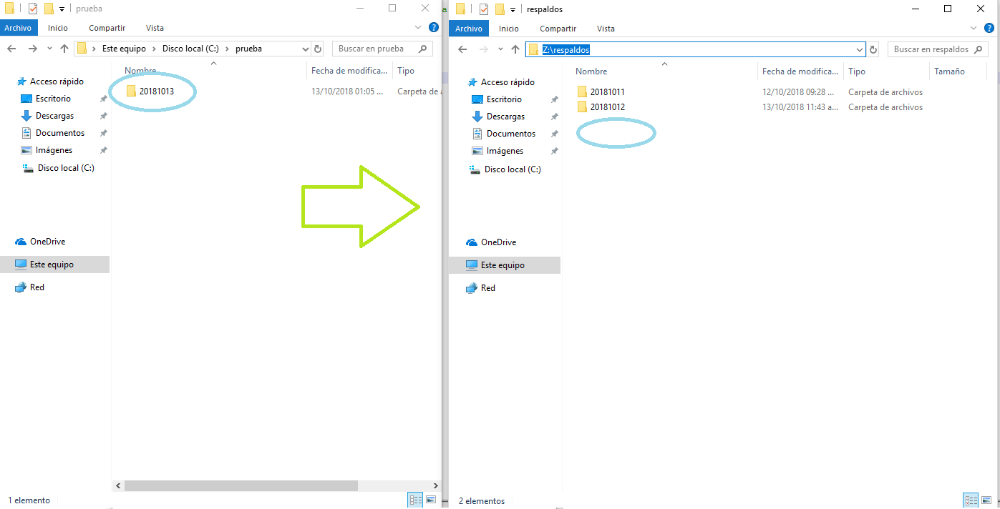
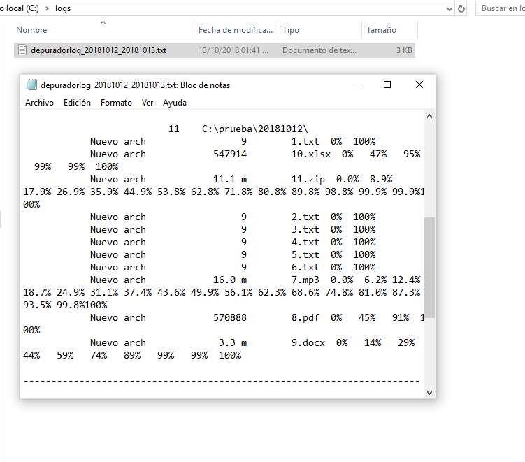

# SX MOVER FICHEROS WINDOWS (batch)

Descarga el archivo .bat y cambia los parametros de unidad de origen y unidad de destino
Así como el nombre de los directorios origen y destino.

El batch esta diseñado para nomenclatura Unidad:\folderA\YYYYMMDD
Puedes editarlo para adecuarlo a tu caso en particular

Variables:

<b>uorigen=</b> Unidad de origen, por ejemplo C:
<b>udestino=</b> Unidad de destino, por ejemplo Z:
<b>dirA=</b> Directorio de origen
<b>dirB=</b> Directorio de destino
<b>input2=</b> A partir de qué carpeta requieres borrar el respaldo (destino), por defecto esta en 4, respaldará 3 carpetas y desde la cuarta serán borradas.
<b>ret=</b> fecha de un día anterior
<b>ret2=</b> fecha de la carpeta que borrará según la opción de respaldo (input2)

El comando de robocopy tiene la opción por defecto MOVE (puedes editar el comando para solo copiar si así lo deseas)

<b>Ejemplo de caso de uso:</b>

Tu servidor de origen genera en todo el día bastantes archivos (80 GB) en tu disco duro de 300 GB, por lo que solo te permite
almacenar 3 días en promedio. Tienes un disco duro de respaldo (o servidor de respaldo al que mapeas como unidad de red su HD), con capacidad de 1TB, por lo que puedes guardar en promedio 12 días de información.

Los arhivos generados en tu servidor de origen tienen nomenclatura "YYYYMMDD", para almacenar los archivos por día (estos valores puedes cambiarlos como gustes).

Por lo tanto, puedes usar este batch como tarea programada windows y mover al final del día (o por la madrugada), los archivos que se generon un día antes para respaldarlos. Posteriormente en la unidad de resplado, se borrarán los archivos que tengan "x" antiguedad (input2=-13), para que ninguno de tus discos se sature y no tengas que realizar la tarea en forma manual.

De esta forma siempre estaran libres tus HD y tendrás los últimos 12 días de información en la unidad de respaldo.

Variables a configurar:

Ejemplo de carpetas con información:

Ejemplo del log, una vez que se ha pasado la información:

Vídeo demo (enlace):

